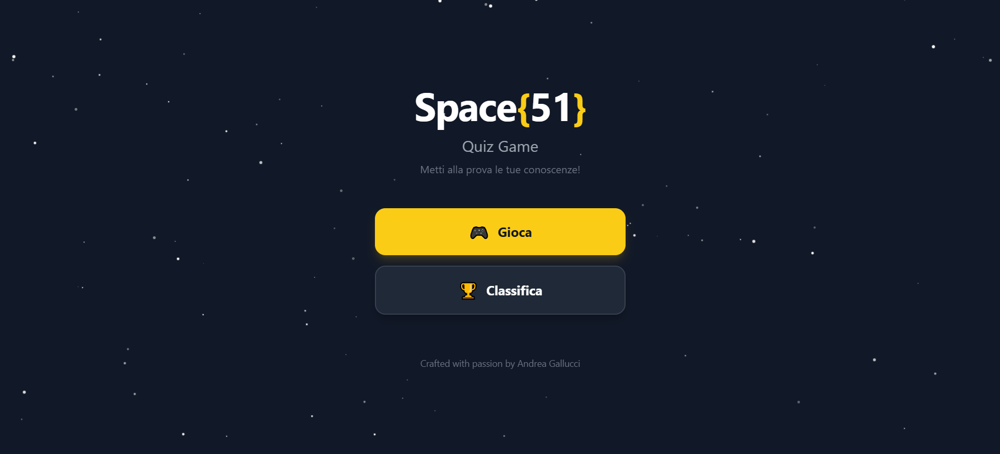
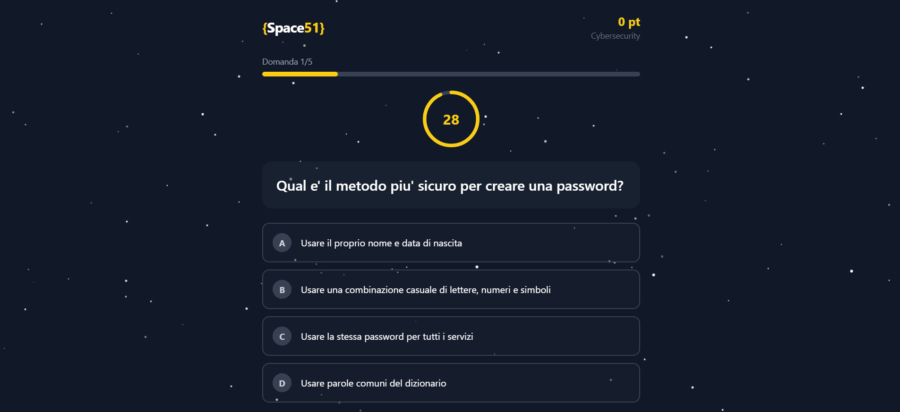
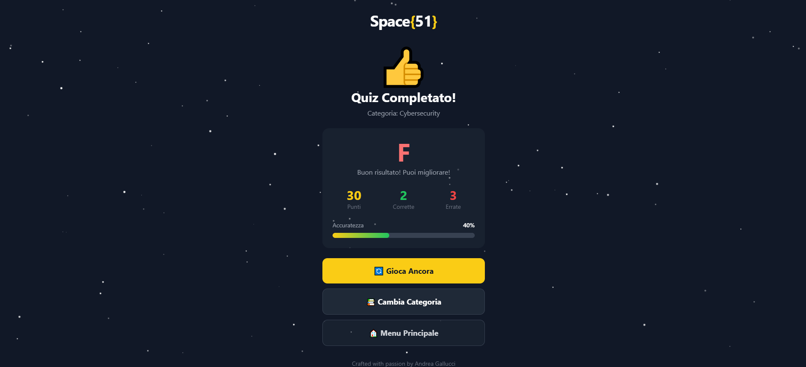

# Space{51} Quiz Game 🚀

Un quiz game interattivo e moderno per testare le tue conoscenze su Cybersecurity, Onboarding e Prodotto.

[](https://quiz-game-umber-nine.vercel.app/)
[](https://reactjs.org/)
[](https://tailwindcss.com/)

---

## 🎮 Demo Live

**[Prova il Quiz Game →](https://quiz-game-umber-nine.vercel.app/)**

---

## 📸 Screenshots

<div align="center">
  
  
  
</div>

---

## ✨ Funzionalità

- **3 Categorie** — Cybersecurity, Onboarding, Prodotto
- **5 domande per categoria** — Con 4 risposte a scelta multipla
- **Timer 30 secondi** — Cerchio animato che cambia colore (giallo → arancio → rosso)
- **Sistema punteggio** — 10 punti base + bonus velocità (max 5 punti extra)
- **Countdown "3-2-1"** — Preparati al lancio prima di ogni quiz
- **Classifica locale** — Salva i tuoi punteggi con il tuo nome
- **Sfondo animato** — Stelle che brillano nello spazio
- **Mobile responsive** — Perfetto su ogni dispositivo

---

## 🛠️ Tech Stack

| Tecnologia | Utilizzo |
|------------|----------|
| **React 18** | UI Components & State Management |
| **Vite** | Build tool & Dev Server |
| **Tailwind CSS** | Styling & Animazioni |
| **localStorage** | Persistenza punteggi |
| **Vercel** | Hosting & Deploy |

---

## 🚀 Installazione Locale

```bash
# Clona il repository
git clone https://github.com/AndreaGallo91/quiz-game.git

# Entra nella cartella
cd quiz-game

# Installa le dipendenze
npm install

# Avvia il server di sviluppo
npm run dev
```

Apri [http://localhost:5173](http://localhost:5173) nel browser.

### Altri comandi

```bash
# Build per produzione
npm run build

# Preview della build
npm run preview
```

---

## 📁 Struttura Progetto

```
quiz-game/
├── index.html
├── package.json
├── vite.config.js
├── tailwind.config.js
└── src/
    ├── main.jsx
    ├── App.jsx
    ├── index.css
    ├── components/
    │   ├── MainMenu.jsx        # Menu principale
    │   ├── HomeScreen.jsx      # Selezione categoria
    │   ├── CategoryCard.jsx    # Card categoria
    │   ├── CountdownScreen.jsx # Countdown 3-2-1
    │   ├── QuizScreen.jsx      # Schermata quiz
    │   ├── ResultsScreen.jsx   # Risultati finali
    │   ├── Leaderboard.jsx     # Classifica
    │   ├── SaveScoreModal.jsx  # Modal salvataggio
    │   └── Space51Logo.jsx     # Logo animato
    ├── data/
    │   └── questions.js        # Database domande
    └── hooks/
        └── useTimer.js         # Hook timer custom
```

---

## 🤖 Built with AI

Questo progetto è stato sviluppato utilizzando un approccio **AI-assisted development** con [Claude Code](https://claude.ai/code).

### Il mio approccio

Ho utilizzato Claude come **pair programming partner** per:

- **Brainstorming** — Definire architettura e funzionalità
- **Scaffolding** — Generare la struttura iniziale del progetto
- **Sviluppo iterativo** — Implementare feature attraverso conversazioni naturali
- **Problem solving** — Debuggare e ottimizzare il codice

### Cosa ho imparato

Lavorare con l'AI non significa "far fare tutto alla macchina". È un processo collaborativo dove:

1. **Tu guidi** — Definisci cosa vuoi, come lo vuoi, lo stile
2. **L'AI accelera** — Scrive codice, suggerisce soluzioni, implementa velocemente
3. **Tu validi** — Controlli, testi, migliori

Il risultato? Un progetto completo in una frazione del tempo, mantenendo il pieno controllo creativo.

---

## 👤 Autore

**Andrea Gallucci**

- Crafted with passion ❤️

---

## 📄 Licenza

Questo progetto è open source e disponibile sotto la [MIT License](LICENSE).

---

<div align="center">
  <strong>Space{51}</strong> Quiz Game — Metti alla prova le tue conoscenze! 🎯
</div>
